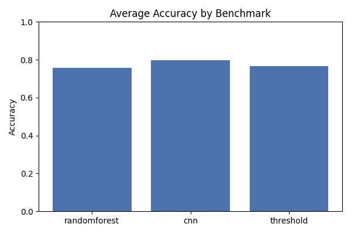
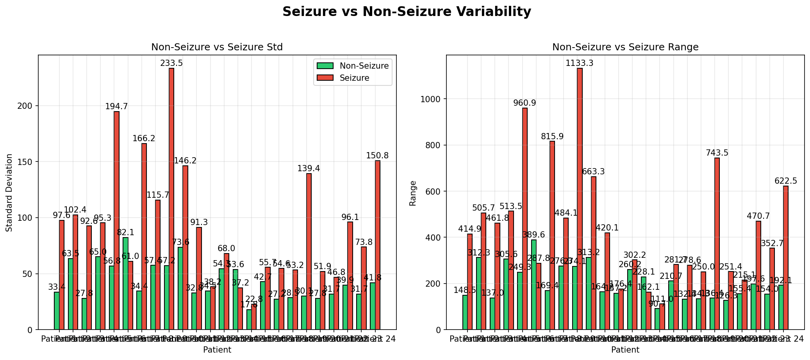
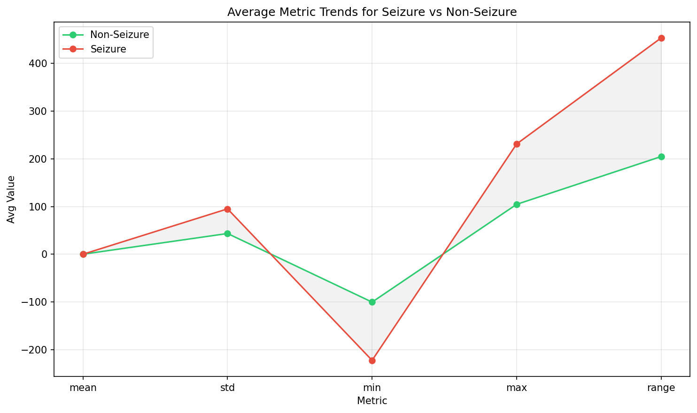
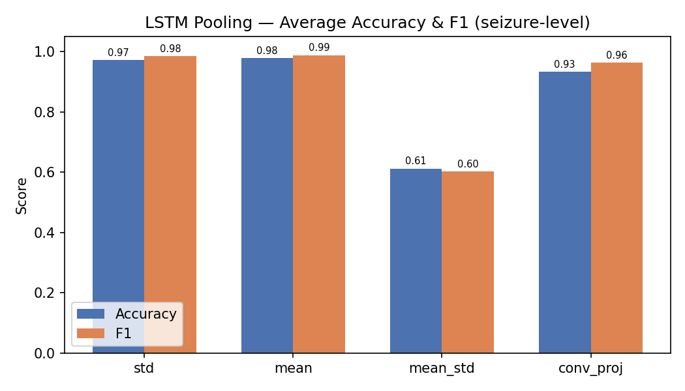
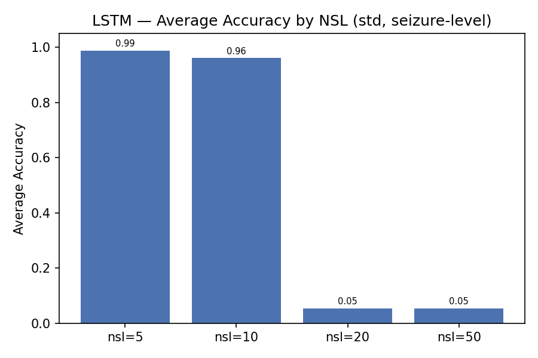

# Deep Learning for EEG Seizure Detection

### Project Report



---

# Abstract

- **4 models**: threshold, random forest, CNN, LSTM
- **Patient-level** and **seizure-level** cross-validation
- 2-fold pilot: CNN leads at 79.7% acc
- LSTM results pending from GPU cluster

---

# Contents

1. Introduction & motivation
2. Dataset & analysis
3. Preprocessing & data flow
4. Methodology: 4 pipelines
5. Cross-validation strategies
6. LSTM design: pooling & context
7. Hyperparameters & experiment grid
8. Results & conclusion

---

# Introduction

Epileptic seizures = abnormal brain electrical activity detectable via EEG.

**Goal**: automatically detect seizures in EEG recordings.

**Approach**: compare progressively richer models:

1. Threshold baseline (hand-crafted rules)
2. Random forest (hand-crafted features)
3. CNN (learned features, end-to-end)
4. LSTM (temporal episode modelling)

---

# Dataset: CHB-MIT

- **Source**: CHB-MIT scalp EEG, 24 pediatric patients
- **Windows**: 1s segments → **571,905** total
- **Seizure**: **86,672** windows (15.2% — imbalanced dataset)
- **Shape**: each window = **21 channels × 128 timesteps**

---

# Dataset: Feature Trends

 

- **Std** and **range** separate seizure from non-seizure
- **Mean** ≈ 0 for both → risky feature alone

---

# Preprocessing & Data Flow



- No per-window normalization (`normalize=False`)
- **Class weighting** helps models focus on the seizure minority

---

# Overview: 4 Pipelines



---

# Pipeline 1: Threshold Classifier


- Computes **std, range, min, max** per window
- Flags seizure if stat exceeds fold-specific threshold
- Thresholds = midpoint of seizure/non-seizure means

---

# Pipeline 2: Random Forest


- **8 features**: mean, std, min, max, range, ptp, std/range ratio, range+std
- 200 trees, `class_weight='balanced'`
- Patient-level 5-fold CV

---

# Pipeline 3: CNN


- **Input**: raw window [21, 128], no normalization
- 3× Conv1d → BN → ReLU → MaxPool
- FC: 2048→256→Dropout(0.3)→2
- Adam (lr=1e-3), class-weighted CE, 2 epochs

---

# Pipeline 4: LSTM



- Groups contiguous same-label windows into **episodes**
- Per-window **pooling** reduces [21, 128] → feature vector
- 2-layer LSTM (hidden=128) + per-timestep classifier
- Seizure-level k-fold with context=20

---

# Cross-Validation Strategies



| Level   | Split by           | Leakage  | Used by            |
| ------- | ------------------ | -------- | ------------------ |
| Patient | whole patient      | None     | Threshold, RF, CNN |
| Window  | window round-robin | Low (±4) | CNN                |
| Seizure | whole episode      | None     | LSTM               |

---

# Seizure-Level k-fold: Context

- Without context: val = **100% seizure** → no specificity measurable
- With `context=20`: ±20 non-seizure windows around each episode
- Val gets realistic ~40–60% non-seizure mix
- Train gets all remaining windows

---

# LSTM: Pooling Options

EEG oscillates around 0 → **mean** collapses amplitude. **Std** preserves it.

| Pool            | Dim  | Speed     | Preserves         |
| --------------- | ---- | --------- | ----------------- |
| `std` (default) | 21   | Fast      | Channel variance  |
| `mean`          | 21   | Fast      | Near-zero — risky |
| `mean_std`      | 42   | Fast      | Center + spread   |
| `conv_proj`     | 32   | Medium    | Learned features  |
| `none`          | 2688 | Very slow | Full waveform     |

---

# LSTM: Architecture

```
Input:  [batch, seq_len, n_features]
            │
  LSTM(input=n_features, hidden=128, layers=2, dropout=0.3)
            │
  Linear(128 → 2) per-timestep
            │
Output: [batch, seq_len, 2]
```

- Packed sequences for variable-length episodes
- Class-weighted CE, `ignore_index=-1` for padding

---

# LSTM: conv_proj Mode

Conv1d projection option replaces hand-crafted pooling:

```
[seq_len, 21, 128]
       │
  Conv1d(21 → 32, k=5, pad=2) → BN → ReLU
       │
  AdaptiveAvgPool1d(1)
       │
[seq_len, 32]  →  LSTM(input_size=32)
```

- Learns waveform features end-to-end
- Faster than `none` (2688-d), more expressive than `std` (21-d)

---

# Hyperparameters

| Parameter    | Threshold | RF       | CNN         | LSTM             |
| ------------ | --------- | -------- | ----------- | ---------------- |
| Trees/layers | —         | 200      | [32,64,128] | 2 LSTM           |
| Hidden size  | —         | —        | —           | 128              |
| Pooling      | —         | —        | —           | std / conv_proj  |
| Class weight | —         | balanced | balanced    | balanced         |
| LR           | —         | —        | 1e-3        | 1e-3             |
| Batch size   | —         | —        | 32          | 32               |
| Epochs       | —         | —        | 2           | 2                |
| Dropout      | —         | —        | 0.3         | 0.3              |
| CV level     | patient   | patient  | patient     | seizure (ctx=20) |

---

# Experiment Grid

| Script                  | Runs                      | ~Time |
| ----------------------- | ------------------------- | ----- |
| `exp1_cnn_levels`       | CNN × 3 levels            | ~1.5h |
| `exp2_lstm_levels_pool` | LSTM × 3 levels + 4 pools | ~5–6h |
| `exp3_lstm_nsl`         | LSTM × 4 NS lengths       | ~3.5h |

All write to `out/benchmarks/` with descriptive suffixes.

---

# Results: Accuracy per Fold (Patient-Level)


High cross-patient variance across all models; CNN ranges 79–93%.

---

# Results: Main Comparison (5-fold)

<div class="columns">

<div>


</div>

<div>

| Model     | CV      | Acc       | F1        |
| --------- | ------- | --------- | --------- |
| Threshold | patient | 75.5%     | —         |
| RF        | patient | 69.0%     | —         |
| CNN       | patient | 86.3%     | 0.554     |
| CNN       | seizure | 80.1%     | 0.888     |
| LSTM-std  | seizure | **97.2%** | **0.985** |

</div>

</div>

---

# Results: Window-Level CV Degeneracy

CNN and LSTM under window-level CV: **97–100% accuracy but 0% F1**

- Round-robin assignment creates unreliable per-fold class ratios
- Models learn to predict "non-seizure" for everything → trivially high accuracy
- **Window-level CV is unsuitable** for this dataset

---

# Results: LSTM Pooling (Seizure-Level)

<div class="columns">

<div>



</div>

<div>

| Pooling          | Avg Acc   | Avg F1    |
| ---------------- | --------- | --------- |
| std (21-d)       | 97.2%     | 0.985     |
| mean (21-d)      | **97.8%** | **0.988** |
| conv_proj (32-d) | 93.3%     | 0.963     |
| mean_std (42-d)  | 61.2%     | 0.601     |

> mean_std unstable (2/5 folds fail)

</div>

</div>

---

# Results: Non-Seizure Length Sweep

<div class="columns">

<div>



</div>

<div>

| NSL | Avg Acc   | Avg F1    |
| --- | --------- | --------- |
| 5   | **98.8%** | **0.994** |
| 10  | 96.1%     | 0.979     |
| 20  | 5.5%      | 0.000     |
| 50  | 5.5%      | 0.000     |

> NSL ≥ 20 → training collapse

</div>

</div>

---

# Key Observations

- **LSTM (seizure-level)** dominates: 97.2% acc, 0.985 F1
- **CNN (patient-level)**: 86.3% acc but F1 only 0.554 — low recall on some patients
- **Window-level CV** produces degenerate results for all models
- **Threshold (75.5%)** outperforms RF (69.0%)
- **Mean & std pooling** both work well; mean_std is unstable
- **NSL ≥ 20** causes LSTM training collapse

---

# Conclusion

- LSTM (seizure-level) achieves best results: **97.2% acc, 0.985 F1**
- CNN (patient-level): 86.3% acc, 0.554 F1 — high variance across patients
- Window-level CV is degenerate — poor class ratios per fold
- Mean pooling slightly outperforms std for LSTM
- **NSL ≤ 10** is essential; NSL ≥ 20 causes collapse
- **Future**: explore multichannel spatial info, longer temporal context

---

# Thank You

**Any Questions?**

